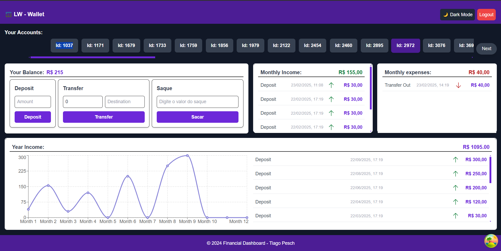
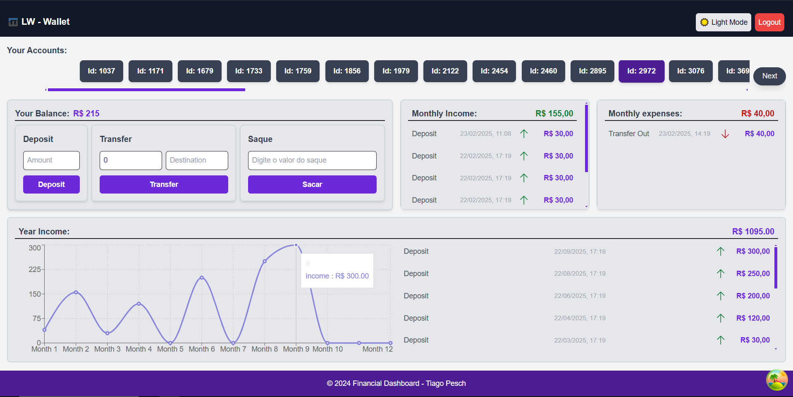

Desafio Wallet - LW
## LW
Este é o frontend do **Painel de Conta Bancária**, um sistema bancário simples desenvolvido em **Next.js** para gerenciamento de contas, saldos e transações financeiras.

---

# *Tecnologias Utilizadas*
O projeto foi desenvolvido com as seguintes tecnologias:

- * Framework:** [Next.js](https://nextjs.org/) (App Router)  
- * Gerenciamento de Estado:** [Redux Toolkit](https://redux-toolkit.js.org/)  
- * Requisições Assíncronas:** [React Query (@tanstack/react-query)](https://tanstack.com/query/latest)  
- * Requisições HTTP:** [Axios](https://axios-http.com/)  
- * Validação de Formulários:** [React Hook Form](https://react-hook-form.com/)  
- * Notificações:** [React Hot Toast](https://react-hot-toast.com/)  
- * Gráficos:** [Recharts](https://recharts.org/)  
- * Autenticação:** JWT armazenado em **cookies**  
- * Estilização:** [TailwindCSS](https://tailwindcss.com/)  
- * Linter:** [ESLint](https://eslint.org/)  
- * Linguagem:** Js  


# Tecnologias usadas no backend.

- * bcryptjs: 3.0.2,
- * cookie-parser: 1.4.7,
- * cors: 2.8.5,
- * dotenv: 16.4.7,
- * express: 4.21.2,
- * jsonwebtoken: 9.0.2,
- * mysql: 2.18.1,
- * nodemon: 3.1.9,
- * prisma: 6.4.1


## *Serviços usados*

* Github

## *Requisitos*
- Docker
- Docker Compose

## Como Rodar o Projeto

### Passo 1: Clonar o Repositório

Para clonar o repositório, execute o seguinte comando no terminal:

```
bash git clone <https://github.com/tiagokp97/desafio_tecnico_d2w.git>
```

### Passo 2: Acessar a Pasta do Projeto

Após clonar o repositório, navegue até a pasta lw:

```
cd lw
```

### Passo 3: Executar o Docker Compose

Agora, para subir todos os serviços da aplicação, execute o seguinte comando:

```
docker-compose up
```

Isso irá iniciar todos os containers e serviços necessários para o funcionamento da aplicação.


###  Principais Funcionalidades da Aplicação
✔️ Login & Logout
✔️ Criação de novas contas
✔️ Consulta de Saldo
✔️ Transferência entre contas
✔️ Saque
✔️ Suporte a Multi-Contas
✔️ Dark Mode 

### Documentação

A documentação completa da aplicação, com todos os tipos de retorno de cada rota, podem ser encontrados nestes links:
```
https://www.postman.com/winter-escape-115766/lw/collection/61oh3p3/lw-wallet
```

E também pode ser importado no seu próprio postman, utilizando o arquivo collection "LW - Wallet.postman_collection" disposto na pasta "documentation" na raiz do projeto

É importante lembrar, que para testar as rotas e seus possíveis retornos, é necessário manter a aplicação rodando conforme disposto no início do texto.

### Dashboard dark mode


### Dashboard white mode



